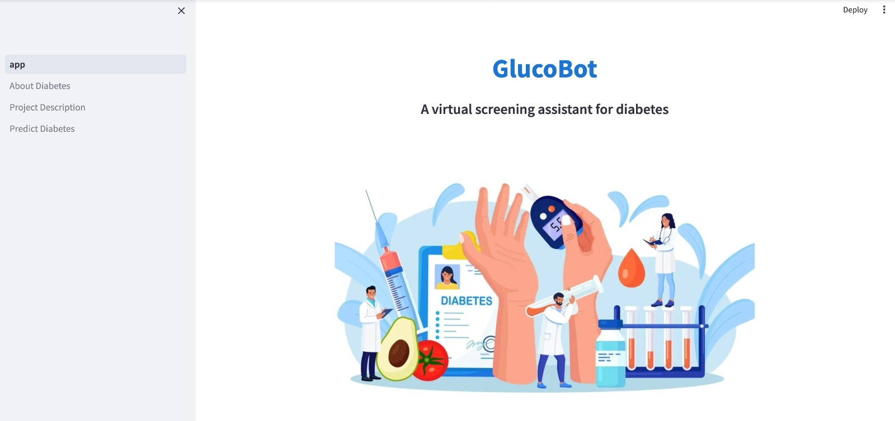

# 🩺 GlucoBot: Diabetes Prediction using Machine Learning



---

## 📘 Project Overview

**GlucoBot** is a data-driven machine learning project designed to predict diabetes risk using clinical data from the **UCI Diabetes Dataset**.  
The project compares multiple supervised learning models, performs feature selection, and integrates model interpretability to support healthcare decision-making.  
A fully interactive **Streamlit web application** enables users to input medical data and receive real-time diabetes risk predictions.

---

## 🎯 Objectives

- Develop a **predictive model** for early diabetes detection using patient health metrics.  
- Apply **statistical feature selection** to identify significant predictors of diabetes (p < 0.05).  
- Evaluate and compare multiple **machine learning models** for accuracy and interpretability.  
- Deploy an interactive **Streamlit app** for real-time prediction and explanation.

---

## 📊 Dataset

- **Source**: UCI Machine Learning Repository – Diabetes Dataset  
- **Records**: ~70,000 medical instances  
- **Attributes**: 14 features including age, BMI, glucose level, blood pressure, and insulin  
- **Type**: Multivariate, Numerical + Categorical  

*(You can add the dataset link here: [UCI Diabetes Dataset](https://archive.ics.uci.edu/ml/index.php))*  

---

## ⚙️ Methodology

### 1. Data Preparation & EDA
- Cleaned, normalized, and visualized 70K+ records.  
- Conducted correlation analysis and statistical summaries to explore feature relationships.

### 2. Feature Selection
- Applied **Chi-Square**, **t-test**, and **Logistic Regression (L1 penalty)**.  
- Retained predictors with **p-value < 0.05**.

### 3. Handling Class Imbalance
- Implemented **5 resampling techniques** (SMOTE, ADASYN, Random Under/Over Sampling, Tomek Links).

### 4. Model Development
- Trained and compared **11 ML models** including:
  - Logistic Regression
  - Random Forest
  - Gradient Boosting
  - XGBoost
  - LightGBM
  - KNN, SVM, Naive Bayes  
- Evaluated using metrics: **F1-score, Recall, Accuracy, Precision**

### 5. Hyperparameter Optimization
- Automated tuning with **Optuna** and **Cross-Validation** to enhance model robustness.

### 6. Model Interpretability
- Applied **SHAP (SHapley Additive exPlanations)** for feature importance and transparency.

### 7. Web App Deployment
- Built an interactive web interface using **Streamlit** named **GlucoBot**, allowing:
  - User input of medical parameters  
  - Instant diabetes risk prediction  
  - SHAP-based explanation of results  

---

## 🧠 Results

| Model | F1-Score | Recall | Notes |
|-------|-----------|--------|-------|
| XGBoost | **0.80** | **0.82** | Best performing model |
| LightGBM | 0.79 | 0.81 | Fast and robust |
| Random Forest | 0.76 | 0.78 | Baseline ensemble |
| Logistic Regression | 0.68 | 0.70 | High interpretability |

**Key Insights:**
- Ensemble methods (XGBoost & LightGBM) outperformed other models.  
- SHAP analysis revealed **Glucose, BMI, and Age** as the most influential predictors.  

---

## 🖥️ GlucoBot Web App

### Features
- Real-time prediction of diabetes risk  
- Interactive SHAP visualizations for model interpretability  
- User-friendly interface built in **Streamlit**

---

## 🧰 Tech Stack

| Category | Tools / Libraries |
|-----------|------------------|
| Programming | Python |
| ML / Data | pandas, numpy, scikit-learn, xgboost, lightgbm |
| Visualization | matplotlib, seaborn, SHAP |
| Optimization | Optuna |
| Web App | Streamlit |
| Deployment | Streamlit Cloud / Local Environment |

---

## 🚀 How to Run

### 1️⃣ Clone the Repository
```bash
git clone https://github.com/YourUsername/GlucoBot-Diabetes-Prediction.git
cd GlucoBot-Diabetes-Prediction
```
---

<p align="center"><small><em>© 2025 Namitha Bhaskar. All rights reserved.</em></small></p>
